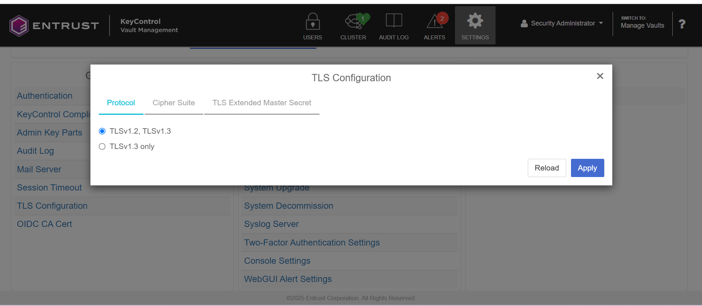

# KeyControl KMSPlugin for Kubernetes

The KeyControl KMS Plugin v2.0 implements the Kubernetes KMS API v2 specification, enabling secure envelope encryption for Kubernetes storage data including secrets using Entrust KeyControl as the key management backend.

## Prerequisites

 * Kubernetes cluster version 1.10.0 or later
 * KeyControl version 5.1 or later
 * Golang must be installed on the server you want to build the plugin. Running the plugin doesn't require Golang. 

## **Important: Enable TLS 1.2 in KeyControl Vault for Compatibility**

If you are using **Entrust KeyControl Vault version 10.4.x**, you must enable **TLS 1.2** for compatibility with the KMS plugin, as TLS 1.3 is not supported.

### **Steps to Enable TLS 1.2:**
1. **Log in** to the KeyControl web interface.
2. Navigate to **Appliance Management > TLS Configuration > Protocol**.
3. Select **TLSv1.2, TLSv1.3** (instead of "TLSv1.3 only").
4. Click **Apply** to save the changes.

For reference, see the attached screenshot.


## Building KeyControl KMSPlugin

1. Clone this repo and cd into keycontrol-kms-plugin

2. To build plugin,  

    ```$ make all```

The above command builds kms-plugin binaries for Linux(kms-plugin-server), Mac(kms-plugin-server.app) & Windows(kms-plugin-server.exe)

3. To clean workspace, 

    ```$ make clean```

## KeyControl Configuration

KeyControl KMS Plugin uses KeyIDs for envelope encryption.

1. Install and setup KeyControl
2. Create and Login into VM Encryption Vault (only on version 10.1 or later)
3. Create a Cloud VM Set on KeyControl WebGUI
4. Create a KeyID under Cloud VM Set. Note that KeyControl only supports 256 bit KeyID for envelope encryption. So select AES-256 as Algorithm while
   creating KeyID.
5. Create and download a client certificate bundle to be used in KMS Plugin for authentication.

## KMS Plugin Configuration

Certificate bundle downloaded from KeyControl needs to be unpacked before it can be used with KMS Plugin

1. To display SSL certificate and private key to be used in KMS Plugin 

   ```$ ./kms_plugin_setup.py show_client_cert <path to certificate bundle>```

2. To display CA certificate to verify KeyControl 

   ```$ ./kms_plugin_setup.py show_ca_cert <path to certificate bundle>```

3. Store the above output to client_cert.pem and ca_cert.pem respecitively.

   ```$ ./kms_plugin_setup.py show_client_cert <path to certificate bundle> > client_cert.pem``` 
   
   ```$ ./kms_plugin_setup.py show_ca_cert <path to certificate bundle> > ca_cert.pem```

4. Create a configuration file (kms_plugin.conf) as follows to store KMS Plugin configuration.

    ```
      {
         "kmsServer": <KeyControl IP/Hostname>,
         "certFile" : "client_cert.pem",
         "caCertFile" : "ca_cert.pem",
         "keyId" : <Keyid name configured on KeyControl>
      }
     ```
5. Execute the following commands to run the plugin. 

   ```$ ./kms-plugin-server --sockFile <socket-file-path> --confFile <config-file-path>```
   
      * <socket-file-path>  - Path to unix socket file (eg: /etc/kubernetes/kmsplugin.sock)
      * <config-file-path>  - KMS Plugin configuration file path (eg: /etc/kubernetes/kms_plugin.conf)

## kube-apiserver Configuration

1. On Kubernetes master node, create an encryption configuration file (/etc/kubernetes/encryption_config.yaml) with following contents

    ```
    apiVersion: apiserver.config.k8s.io/v1
    kind: EncryptionConfiguration
    resources:
      - resources:
        - secrets
        providers:
        - kms:
            apiVersion: v2
            name: KeyControlKmsPlugin
            endpoint: unix:///etc/kubernetes/kmsplugin.sock
            timeout: 3s
        - identity: {}
     ```

2. Edit /etc/kubernetes/manifests/kube-apiserver.yaml to include encryption configuration for kubeapi-server 

     ```- --encryption-provider-config=/etc/kubernetes/encryption_config.yaml```
     
3. Add volume mount paths in kubeapi-server configuration so that it can read "encryption_config.yaml" file and "kmsplugin.sock"
4. Save "kube-apiserver.yaml" and exit. api-server will detect changes in "kube-apiserver.yaml" file and restart.

## Verifying if plugin is configured correctly

Create a new secret and check KeyControl Audit logs to see encryption logs.

